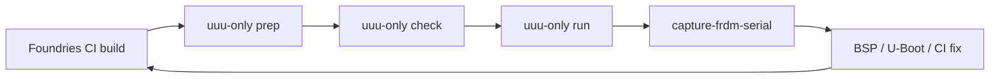

# FRDM-IMX95 Foundries LmP — lab workflow

Goal: **`meta-dynamicdevices-bsp`** + Foundries factory **`dynamic-devices`**, machine **`imx95-frdm-evk`**, CI branch **`main-imx95-frdm-devel`**.

This doc is the **single loop** for bench work. Hardware steps run in **your terminal** so Cursor does not spam **Allow** on every command.

## Loop



| Step | Who | Command |
|------|-----|---------|
| 1. CI | Foundries portal / `fioctl` | Wait for green target (note number, e.g. **2735**) |
| 2. Download | You | `./scripts/flash-imx95-uuu-only.sh prep 2735` |
| 2b. Verify | You | `./scripts/flash-imx95-uuu-only.sh check 2735` (prints `full_image-nxp-boot.uuu`) |
| 3. Flash | You | Board **SW1 (0,1)**, USB **J3** → `./scripts/flash-imx95-uuu-only.sh run 2735` (uncompressed `.wic` — default) |
| 4. Boot check | You + agent | **SW1 (1,0)** eMMC → `./scripts/capture-frdm-serial.sh` (power-cycle when prompted) |
| 5. Iterate | Together | You paste `logs/frdm-serial-*.log`; agent edits BSP/docs — **no agent shell on USB/serial** |

## Programming: one uuu script only

Use **`flash-imx95-uuu-only.sh`** until this works end-to-end. Do **not** use the full `flash-imx95-foundries.sh` for daily work.

```bash
./scripts/flash-imx95-uuu-only.sh prep 2735
./scripts/flash-imx95-uuu-only.sh check 2735
./scripts/flash-imx95-uuu-only.sh run 2735     # default: uncompressed .wic
```

### Flash uncompressed WIC (required on imx95 FRDM)

**uuu does not gunzip.** `full_image-nxp-boot.uuu` uses Foundries **`.wic.gz`**; imx95 fastboot writes gzip bytes to eMMC → **no GPT** (`mmc part` → Unknown partition table).

Use the companion script that references the **host-decompressed `.wic`** (created at `prep` / first `regen`):

```bash
cd downloads/target-2735/flash-bundle
sudo -n uuu -pp 100 full_image-nxp-boot-wic-uncompressed.uuu
```

Or via the helper (same script, now the **default** for `run`):

```bash
./scripts/flash-imx95-uuu-only.sh run 2735
# explicit: --wic-uncompressed (default) or --wic-compressed (debug only)
```

FB line must show **`lmp-factory-image-imx95-frdm-evk.wic`** not **`.wic.gz`**. After flash, U-Boot `mmc part` should show GPT partitions.

**NXP LF bundle required for `prep`:** `~/Downloads/LF_v6.18.2-1.0.0_images_IMX95` (symlinks `*-flash_all` into the bundle). Without it, `check` fails on `imx-boot-imx95-15x15-lpddr4x-frdm-sd.bin-flash_all`.

The uuu script (generated in the bundle) is the same idea as NXP’s path: **NXP `flash_all` at SDPS/SDPV**, then **Foundries WIC + production `imx-boot`** over fastboot.

Archived: `scripts/archive/flash-imx95-foundries.full.sh` (only if you need old behaviour).

## ser2net (boot capture)

- TCP **`localhost:2000`** → `/dev/ttyACM0` @ **115200** (U-Boot console after flash).
- **uuu / SPL** uses **921600** on the same USB port — **stop ser2net** before flash (`flash-imx95-uuu-only.sh run` does this).

## One-time host setup

```bash
./scripts/install-flash-sudoers.sh
./scripts/install-sudo-askpass.sh   # optional; agents use sudo -A
# ser2net: config/ser2net/imx95-ttyACM0.yaml → /etc/ser2net.d/
```

## Agent / Cursor

- **You** run: `fetch`, `flash`, `serial`, `uuu`.
- **Agent** reads: `logs/`, `docs/`, BSP notes — edits **`meta-dynamicdevices-bsp`** / factory-integration.
- Avoid background agents for `systemctl`, `/dev`, `uuu` (sandbox **Allow** loops).

## References

- Flash detail: [imx95-foundries-emmc.md](imx95-foundries-emmc.md)
- Factory merge: [../factory-integration/README.md](../factory-integration/README.md)
- BSP issue (SDPV): [meta-dynamicdevices-bsp#12](https://github.com/DynamicDevices/meta-dynamicdevices-bsp/issues/12)
